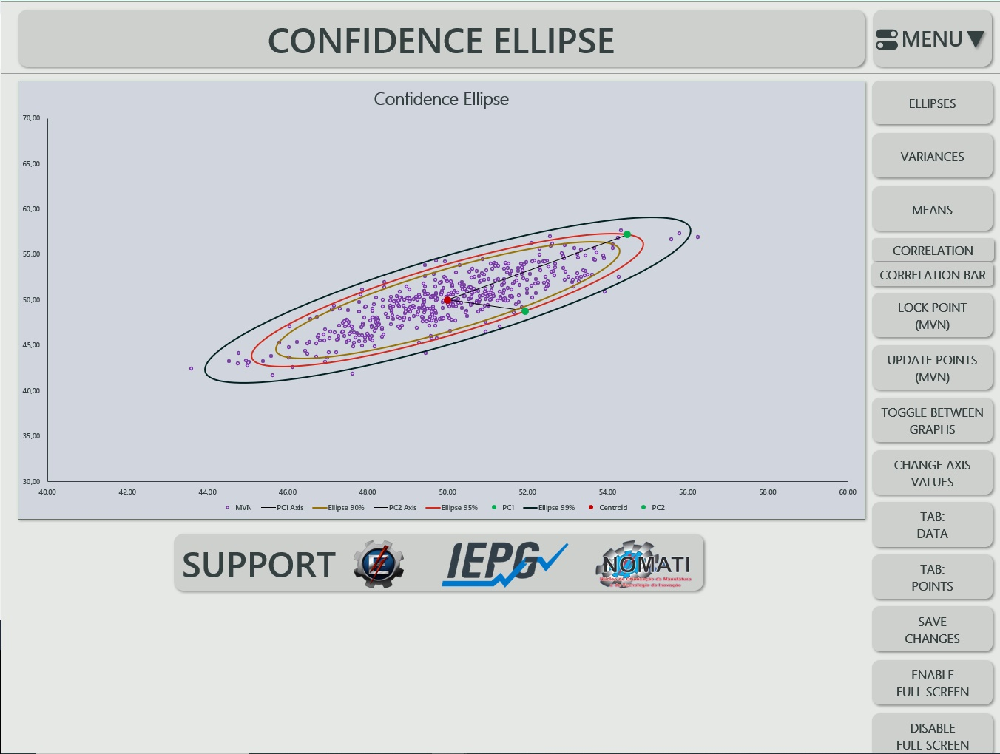
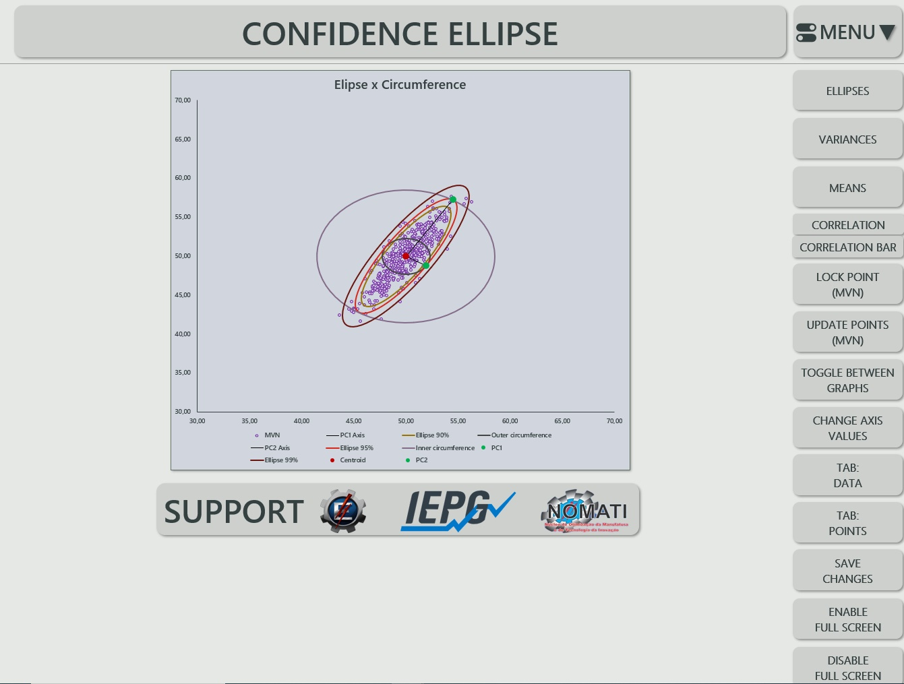
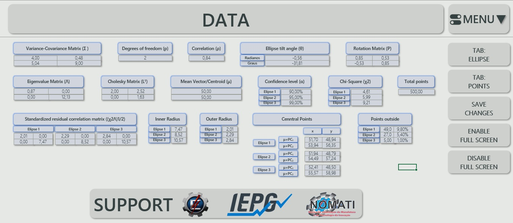
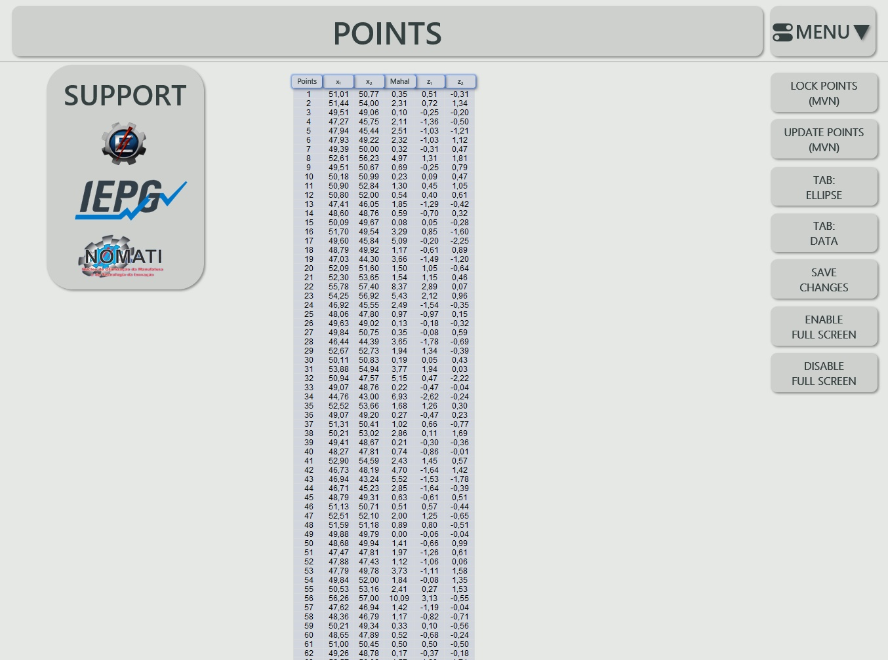

# 📈 Confidence Ellipse: VBA Code

## 📝 Description

This repository contains **VBA code** for creating and analyzing **Confidence Ellipses** with **multivariate data**.

The code is designed to run within **Excel**, allowing users to work with **confidence ellipses** in both **educational** and **industrial contexts**. You can modify the **confidence interval**, **variance**, **mean**, **correlation**, and **multivariate points** in real time, and interactively explore results directly in **Excel via VBA**.

---

## 🛠️ How to Use

1. **Clone or download** this repository to your local machine.  
2. **Open** the **Excel file** containing the **VBA macros**.  
3. **Enable macros** in **Excel**.  
4. **Run** the desired **VBA routines** from the **VBA editor** or assign them to **buttons** in your Excel sheets.  
5. The code includes **detailed comments** and **figures** to help you understand its functionality.  

---

## 📚 Publications

Other articles are in progress; the current public papers related to this tool are:

- **The use of the confidence ellipse combined with computational fluid dynamics in a centrifugal fan** (*O uso da elipse de confiança combinada a fluidodinâmica computacional em um ventilador centrífugo*)  
  [Read here](https://www.abepro.org.br/biblioteca/TCE_413_2028_47556.pdf)
- **Integration of confidence ellipses in the evaluation and development of centrifugal fans** (*Integração de elipses de confiança na avaliação e no desenvolvimento de ventiladores centrífugos*)  
  [Read here](https://www.abepro.org.br/biblioteca/TN_ST_403_1982_46273.pdf)
- **Application of the confidence ellipse as support for precision analysis in measuring the concentration of water-in-oil (W/O) emulsions** (*Aplicação da elipse de confiança como apoio à análise de precisão na medição de concentração de emulsões de água em óleo (W/O)*)  
  [Read here](https://www.abepro.org.br/biblioteca/TN_ST_401_1969_46756.pdf)
- **Confidence ellipses and data analysis in computational fluid dynamics simulations** (*Elipses de confiança e análise de dados em simulações computacionais de fluidodinâmica*)  
  [Read here](https://www.abepro.org.br/biblioteca/TN_ST_413_2028_48255.pdf)

---

## 📁 Worksheets Included

| Worksheet      | Description                                         |
|----------------|-----------------------------------------------------|
| **Dashboard**  | Confidence ellipses and all possible modifications. |
| **Data**       | Data used to construct the confidence ellipse.      |
| **Points**     | Multivariate points.                                |

---

## 🖼️ Figures and Video

| Example                     | Screenshot / Link                  | Description                              |
|-----------------------------|------------------------------------|------------------------------------------|
| Confidence Ellipse Video    | [Download Video](Confidence_Ellipse_Video.mp4) | Video explanation of the functionality.  |
| Dashboard Home              |  | Initial screen of the Dashboard sheet.   |
| Dashboard Circumference     |  | Ellipse circumference visualization.     |
| Data Home                   |         | Initial screen of the Data sheet.        |
| Points Home                 |     | Initial screen of the Points sheet.      |

---

## ⚙️ Main VBA Routines

Click to expand the list of main routines

- `1. Ellipses`
- `2. Variances`
- `3. Means`
- `4. Correlation`
- `5. Correlation Bar`
- `6. Lock Point (MVN)`
- `7. Update Points (MVN)`
- `8. Toggle Between Graphs`
- `9. Change Axis Values`
- `10. Save Changes`
- `11. Enable Full Screen`
- `12. Disable Full Screen`
- `13. Tab: Ellipse`
- `14. Tab: Data`
- `15. Tab: Points`

---

## 📬 Contact

---

> _Feel free to open issues or PRs, or reach out for collaboration or questions!_
